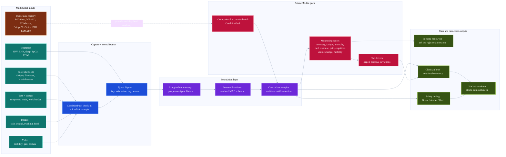

# Attune AI

**A condition-agnostic concordance engine for at-home chronic condition management.**

Built for the eMed × OpenAI hackathon (London, 17–18 Jul 2026).

Attune is one engine that fuses multimodal signals (voice, text, image, wearable) into a
per-patient longitudinal memory, finds **concordance** — when signals move together — and uses
it to warn early and coach. A thin `ConditionPack` config turns the same engine into a
different product per condition.

---

## The pitch

We don't ship a PCOS app or a veteran app. We ship the **engine**, and each condition is a
config pack loaded on top. That's the innovation — and it speaks to what eMed literally is: a
*consumer healthcare platform provider*. We built the platform layer.

- **Deep demo — PCOS** (metabolic, eMed's home turf): cycle × high-GI meals × mood flares,
  vision-scored acne/hirsutism, a Rotterdam-mapped clinician brief.
- **Generalization proof — veterans/firefighters** (mind–body comorbidity): the *same*
  concordance engine, with mood promoted to a first-class **psychological** axis coupled to a
  **physiological** axis (HRV, sleep) — early-warning of a bad week ~2 days out, plus a
  higher-acuity crisis-escalation path.
- **Foundation-model wedge — AttuneFM-lite** (occupational + chronic-health monitoring): a
  broad multimodal pack that treats wearables, voice, text, images, and video as first-class
  monitoring channels for recovery, fatigue, medication/lifestyle response, visible change,
  mobility change, pain interference, cognitive fog, and clinical summaries.

The last thing the judges see is the mic-drop: *the same code becomes condition-specific care
or a general AttuneFM-lite personal nurse layer by swapping configuration, not engine code.*

## Why it's novel (couldn't exist 2 years ago)

Cheap voice-affect (Realtime) + zero-shot vision extraction (GPT-4o) + an LLM reasoner over a
typed longitudinal memory. No custom training — frozen foundation models + a real memory layer
+ a seeded synthetic patient. The moat is the **longitudinal multimodal memory**, not the voice.

## Architecture

```
capture/            audio · text · image  ──►  typed Signal
concordance_engine/
  memory.py         typed longitudinal Signal store + window/baseline queries
  concordance.py    personal baselines (robust z) + cross-axis concordance
  safety.py         tiered escalation with a DETERMINISTIC crisis floor
  brief.py          maps memory → BriefTemplate criteria (Rotterdam / cardiometabolic)
  engine.py         ties memory + pack together; ingest / reflect / assess / brief
packs/
  base.py           the ConditionPack abstraction (the swappable config surface)
  pcos.py           metabolic-first pack (deep demo)
  veteran.py        mind–body pack (generalization proof)
  attunefm.py       occupational/chronic-health multimodal pack
checkin.py          the daily voice-first check-in routine → typed Signals
attunefm.py         monitoring scores over the shared longitudinal memory
datasets.py         real public dataset registry for grounding each modality/head
reporting.py        presentation layer — render a Brief to clinician markdown
synth.py            seeded synthetic patients with a planted concordant flare
```

### AttuneFM-lite architecture



### Voice-first daily check-in

The **core channel is voice** — a short daily spoken check-in, tuned to the pack's persona
register, with optional "show me" photo turns. It's the accessible, low-friction surface for
patients who aren't digitally native, and low friction is what sustains adherence. The routine
is pack-declared (`ConditionPack.checkin`); `record_checkin` maps answers to typed `Signal`s.
Voice (Realtime) and vision (GPT-4o) are the *transports* wired in at capture (step 3) — the
routine and downstream assessment already exist and are the same engine.

**One engine, swappable packs.** Everything condition-specific lives in a `ConditionPack`:
signal→axis map, coupling hypotheses (seed the reflection pass), the clinical brief template,
the agent persona/register, and the escalation contract. Everything else is shared code.

### Concordance = specificity

Fire the early-warning when **≥2 axes deteriorate together** relative to the patient's *own*
baseline (robust median/MAD z-scores) — not when any single noisy channel blips. That's the
false-alarm guard and the reason the signal is actionable. `test_single_axis_blip_does_not_fire`
locks this behaviour.

### Safety (what wins the clinical judges)

Safety-critical decisions never rest on the LLM alone. Red tier fires on the **union** of a
deterministic keyword floor and the classifier — an LLM miss can't silently drop a crisis
(fail-safe, not fail-open). The agent never autonomously *treats* acute risk; it de-escalates,
surfaces resources, and does a **warm human handoff**.

| Tier | Trigger | Behaviour |
|---|---|---|
| Green | within baseline | coach autonomously |
| Amber | concordant multi-axis drift | more support + async clinician brief |
| Red | crisis language / affect | stop managing → de-escalate → warm handoff |

### Real-data grounding

The offline demo uses a seeded patient so the pitch is deterministic, but the AttuneFM-lite
signals are grounded against real public datasets listed in `attune.datasets`:

| Capability | Public datasets |
|---|---|
| Sleep / recovery | BIDSleep, real-world smartwatch HRV |
| Stress / autonomic load | WESAD, SSAQS |
| Work and activity context | ExtraSensory, PAMAP2 |
| Diet / metabolic response | CGMacros, HUPA-UCM, SNAPMe |
| Voice check-ins | Bridge2AI-Voice |
| Image / visible change | DDI, lower-limb wound dataset |

That gives enough data for realistic monitoring behavior and calibration demos. It is not
enough to claim clinical validation, disease diagnosis, medication adjustment, or fitness-for-work
decisions.

## Quickstart

```bash
uv venv && uv pip install -e ".[dev]"
uv run pytest            # concordance + safety + pack + brief + demo logic
uv run attune-seed       # write seeded patients to data/
uv run attune-demo       # narrate both packs end-to-end (or: attune-demo veteran)
uv run attune-demo attunefm  # occupational/chronic-health personal nurse layer
```

Or through `mise`:

```bash
mise run init
mise run test
mise run demo-attunefm
mise run demo-attunefm-profile firefighter_recovery
mise run demo-attunefm-profile firefighter_asthma
mise run demo-attunefm-profile veteran
mise run demo-attunefm-profile metabolic_pcos
```

```python
from attune import load, Signal, Axis

eng = load("veteran")                       # or "pcos"
eng.ingest(Signal("hrv", Axis.PHYSIOLOGICAL, 42.0, day=30, source="wearable"))
finding = eng.reflect(day=30)               # concordant? which axes?
verdict = eng.assess("rough night, no sleep", day=30)   # Green / Amber / Red
```

## Build plan (hackathon)

1. ✅ **Engine + packs** — memory, concordance, safety, PCOS + veteran packs.
2. ✅ **Seeded patients** — deterministic synthetic histories with a *planted* concordant flare
   the reflection pass discovers live; `attune-seed` writes them to `data/`.
3. ✅ **AttuneFM-lite pack** — wearables + voice + text + image + video signals for occupational
   health, chronic illness, medication/lifestyle response, visible change, and mobility change.
4. **Capture** — the voice-first check-in routine (`checkin.py`) is built + demoable offline;
   remaining is wiring `capture/` to Realtime (voice) + GPT-4o vision so live answers/photos fill
   the same `record_checkin` responses.
5. ✅ **Brief generator** — maps memory onto the pack's `BriefTemplate` (Rotterdam / cardiometabolic).
6. ✅ **Demo surface (offline)** — `attune-demo`: timeline → live concordant warning → clinician
   brief → AMBER/RED escalation → PCOS↔veteran↔AttuneFM hot-swap. Capture (step 4) swaps in live signals.

## Feasibility / credits

Everything is a frozen API call — OpenAI Realtime (voice), GPT-4o vision, embeddings
(memory retrieval), Runware (motivational visuals). No training. 2500 OpenAI credits cover a
demo many times over; Realtime is the only pricey call.
