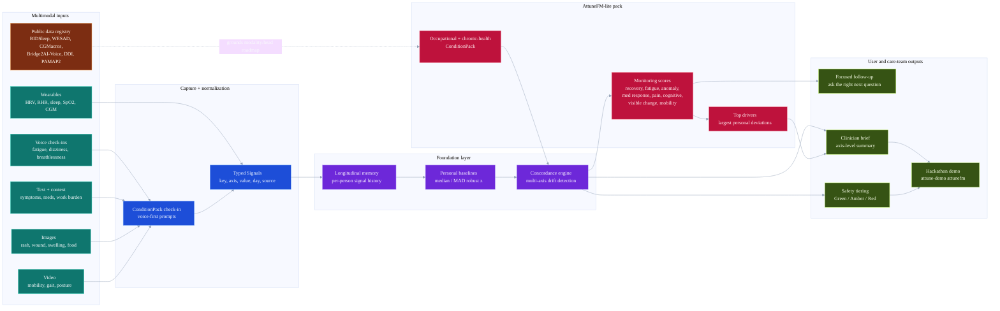

# AttuneFM-lite Design

## Summary

AttuneFM-lite is a hackathon-scoped prototype of a multimodal wearable foundation model for occupational health, chronic illness monitoring, lifestyle and medication response tracking, and clinical summaries. It does not diagnose disease or replace a clinician. In the existing Attune repo, the first implementation uses the longitudinal memory and concordance engine as the foundation layer, then exposes monitoring heads for triage and summarisation. A trainable PyTorch fusion model is a stretch path once the demo workflow is solid.

The prototype should be credible on one A100 80GB and demonstrable before the Saturday 18 July 2026 3pm submission deadline. The build should optimise for a clear end-to-end story over raw model scale.

## Product Claim

Attune learns each person's physiological baseline, checks in through wearables and voice, detects meaningful changes, and turns daily signals into actionable occupational and clinical summaries.

## Non-Goals

- No arbitrary disease diagnosis from wearable data.
- No attempt to reproduce Google SensorFM-scale pretraining.
- No autonomous medication, treatment, or return-to-work decisions.
- No regulated medical-device claim in the hackathon prototype.

## Inputs

The model accepts whichever modalities are available and must tolerate missing channels.

| Modality | Examples | Hackathon source |
|---|---|---|
| Wearables | HR, HRV, resting HR, SpO2, skin temperature, steps, sleep, activity | public wearable datasets plus synthetic unified timeline |
| Context | medication changes, diet, exercise, sleep routine, work calendar, symptoms, labs | synthetic timeline plus public metadata where available |
| Voice | daily check-in transcript, symptom report, medication adherence, acoustic features | simulated transcripts and optional Bridge2AI-style feature table |
| Image | skin, rash, wound, swelling, food, medication reaction photo | optional CLIP/SigLIP embeddings or metadata stubs |
| Video | gait, posture, breathing effort, mobility, ergonomics | optional pose/mobility feature stubs |
| Environment | heat, air quality, shift, workplace exposure | synthetic context fields |

## Architecture

Source diagram: `docs/diagrams/attunefm-lite-architecture.mmd`.



### Modality Encoders

Wearable encoder:
- Converts per-day or per-hour physiological windows into tokens.
- Supports HR, HRV, RHR, SpO2, sleep, steps, temperature, respiratory-rate-like fields, and CGM when present.
- Uses a small Transformer or temporal MLP for the hackathon build.

Context encoder:
- Embeds medication, diet, exercise, sleep, work, symptom, lab, and environment events.
- Keeps event timing explicit so before/after response heads can compare pre-period and post-period states.

Voice encoder:
- Uses transcript embeddings and simple check-in fields for the first build.
- Optional acoustic features include speech rate, pause length, energy, breathiness, and response latency.

Image encoder:
- Uses frozen CLIP/SigLIP-style embeddings or simple metadata for first build.
- Supports visible change tracking for wounds, rashes, swelling, food photos, and workplace scene context.

Video encoder:
- Uses derived features rather than raw video training for first build.
- Supports gait speed proxy, pose/posture features, sit-to-stand proxy, breathing-effort proxy, and movement smoothness.

### Personal Baseline Module

The baseline module estimates each person's normal range and compares current windows against that range. This lets Attune separate population-level risk from "unusual for me" changes.

Baseline features:
- rolling mean and variance over 7, 30, and 90 day windows
- day-vs-baseline residuals
- event-aligned before/after deltas
- missingness and sensor-quality indicators

### Fusion Model

The fusion model combines modality tokens into a shared health-state embedding. For the hackathon build, it should be small and robust:

- hidden size: 64-256
- 1-4 Transformer layers or a gated MLP fusion block
- missing-modality mask
- modality type embeddings
- subject/person embedding for longitudinal demos

## Task Heads

| Head | Output | Purpose |
|---|---|---|
| Recovery capacity | low / normal / strong or 0-100 score | daily capacity and chronic illness pacing |
| Fatigue/readiness | fatigue risk score | office work, shift work, occupational safety |
| Personal anomaly | anomaly score plus top drivers | unexplained physiological changes |
| Work-pattern burden | burden score | meetings, shifts, workload, ergonomics |
| Metabolic/diet response | response score | CGM, diet, weight-loss, sleep/activity effects |
| Medication/lifestyle response | expected / non-response / tolerance signal | before/after monitoring |
| Visible health change | change flag and trend | wound, skin, rash, swelling, medication reaction |
| Mobility/frailty change | change flag and trend | elderly support, fall-risk proxy, return-to-work |
| Clinical summary | short narrative | clinician/caregiver/occupational-health report |

## Public Data Strategy

Use public datasets to demonstrate that the architecture is grounded in real modalities, then use a synthetic unified Attune timeline for the demo narrative.

Priority datasets:
- BIDSleep PhysioNet: Apple Watch HR and accelerometry with EEG sleep-stage labels.
- real-world smartwatch HRV dataset: Samsung watch HRV, motion, sleep diaries, anxiety/depression/insomnia questionnaires.
- WESAD: wearable stress and affect physiology.
- ExtraSensory: phone/watch context labels including work, computer work, sleep, activity, talking.
- PAMAP2: activity and exertion from IMU plus heart-rate data.
- SSAQS: Fitbit HRV, sleep, SpO2, activity, stress/anxiety ratings.
- CGMacros or HUPA-UCM: CGM, food, activity, sleep, glucose/metabolic response.
- Bridge2AI-Voice: derived voice features linked to health information.
- DDI, wound, SNAPMe/Open Food Facts: optional image evidence.

## Hackathon Demo Scenario

The demo should show one longitudinal person and one occupational/chronic-health workflow:

```text
Baseline:
  stable sleep, HRV, resting HR, work cadence

Event:
  medication start or dose change
  heavy work week
  poor sleep
  diet/exercise change
  optional image/video evidence

Physiology:
  HRV down
  resting HR up
  sleep disrupted
  fatigue score rising
  anomaly score rising

Voice check-in:
  "I felt dizzy and unusually exhausted today."

Attune:
  asks a follow-up
  flags recovery impairment
  explains top drivers
  generates a clinician/caregiver summary
```

## Implementation Scope

Minimum viable build:
- AttuneFM-lite condition pack for occupational and chronic-health monitoring
- seeded multimodal timeline using the existing synthetic patient generator
- monitoring score adapter over the existing concordance engine
- heads for recovery, fatigue, anomaly, medication/lifestyle response, visible change, and mobility change
- image and video as first-class signal modalities
- offline CLI demo through `attune-demo attunefm`
- clinical summary renderer through the existing `BriefTemplate` path

Stretch:
- PyTorch fusion model over exported memory windows
- public dataset adapter for one or two datasets
- image/video embeddings from frozen open encoders
- simple web dashboard
- model card and submission writeup

## Safety And Privacy

Attune must present outputs as monitoring and triage signals:
- "recovery is lower than your baseline"
- "physiology changed after medication change"
- "consider sharing this summary with your care team"

It must not present outputs as:
- diagnosis
- treatment advice
- medication adjustment
- employment fitness decision

Employer-facing views should be aggregate-first and avoid exposing sensitive individual medical details unless explicitly configured for occupational-health clinical workflows.

## Submission Artifact

The hackathon submission should include:
- runnable prototype
- one demo timeline
- one generated clinical summary
- short architecture diagram
- explanation of which parts use public data and which parts are simulated
- clear limitations and safety boundaries
